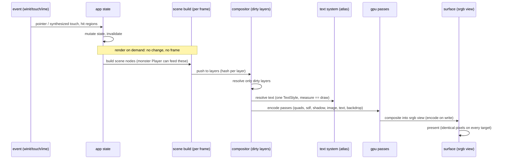

# plev


AGENTS.md is the single instruction source: the operating contract for ai agents and contributors. claude code only auto-loads CLAUDE.md, so CLAUDE.md is a one-line stub that imports it (`@AGENTS.md`). every tool routes here on init; no per-tool instruction files, no content in the stub.

the engine builds a scene every frame, resolves only the layers that
changed, and composites into an srgb surface. desktop draws it on metal, the
web draws it on webgpu, and the pixels are identical because the same code
runs on both. glass, backdrop blur, analytic shadows, content-driven layout,
real text shaping. the apps consume the engine. nothing bypasses it.

the differentiator is not one feature. it is the set: a compositor with
dirty-layer caching, a measured visual language, the same pixel on every
platform, and an animation format of its own. those pieces do not exist
assembled anywhere else.

## architecture

one render-on-demand loop. no change, no frame. unchanged layers cost zero
gpu work.



three tiers. the engine is the root crate. libraries and apps are separate
crates. demos are examples.

| tier | where | what |
|---|---|---|
| engine | root `plev` | gpu, compositor, text, path, layout, input, animation, signal, theme, ui, builder, window, platform |
| crates | crates/ | git, ide, lot, monster, narrate, narrate-macro, parser, prime_creatures, rope, showcase |
| examples | examples/ | 16 windowed demos plus the lot2monsters cli |

machine map: [doc/arc/arc.yaml](doc/arc/arc.yaml). human reference:
[doc/arc/arc.md](doc/arc/arc.md). frame-flow diagram:
[doc/arc/arc.mmd](doc/arc/arc.mmd).

## binding contracts

violations are defects even when the pixels look right.

- one TextStyle per text run, shared by measurement and drawing. the only
  width source is the shaper, never an arithmetic estimate.
- srgb decode once entering gpu work, encode once at the surface write.
- container geometry derives from available space, never from constants.
- a visible state change implies invalidation. no silent redraws, no silent
  stale frames.

## install

requires rust edition 2024.

```
cargo build --release --workspace
```

web build (same pixels as desktop):

```
trunk serve
```

## run

```
cargo run -p showcase            # the design-system gallery, 11 tabs
cargo run -p ide [path]          # plev-native git client
cargo run -p prime_creatures     # prime-coherence particle swarm (codepen port)
cargo run --example charts       # any of the 16 windowed demos
cargo run --example snake
```

the monster animation pipeline, lottie in and our format out:

```
cargo run --example lot2monsters in.json out.monster   # convert once
cargo run --example monster_player out.monster         # play ours, no lottie
```

## mobile

the showcase runs natively on android and ios from the same engine. it is a
library (`crate-type = ["lib", "cdylib", "staticlib"]`) whose app shell exposes
one entry point per platform; there is no kotlin or swift ui, every pixel is
drawn on the gpu by plev.

ios (simulator) needs xcode, the `aarch64-apple-ios-sim` rust target and
`xcodegen`:

```
cd ios/showcase
./build_ios.sh      # cargo staticlib + xcodegen + xcodebuild
./run_ios.sh        # boot a simulator, install, launch, screenshot
```

android needs the sdk/ndk, a jdk 17 and `cargo-ndk`:

```
cd android
./build_android.sh  # cargo-ndk -> jniLibs (arm64-v8a, x86_64) + gradle apk
                    # -> app/build/outputs/apk/debug/app-debug.apk
```

a GameActivity host (`MainActivity.kt`) loads `libshowcase.so` and hands off to
the rust `android_main`; on ios a thin objc `main.m` calls `showcase_ios_main`.
the engine keeps its own `android_main` behind the `android-entry` feature (off
by default) so downstream apps ship their own without a symbol clash.

## the monster format

a binary animation format, magic `MON0`, frozen at v1. keyframes are full
scene snapshots so seek is O(1); between them only discovered deltas travel,
and a node that does not change costs zero bytes. quantized on the wire,
checksummed per section, a description track per keyframe for accessibility
and search. it plays on the same engine that draws the ui. `lot` reads a
lottie json once, converts it to `.monster`, and never embeds a foreign
runtime. discrete motion already beats the source json on size; full-body
morphs wait on the v1 morph-track lever. see
[kdb/adr/monster-format-v0.md](kdb/adr/monster-format-v0.md).

## the parser

`crates/parser` turns ui source from another framework into plev builder
code. it maps colors to hoff theme tokens, obeys the engine contracts, and
reports every construct it cannot represent on a droplist with file and
line. it never drops a construct silently. run it live:

```
cargo run -p parser --example transpile  index.tsx module.sass vars.sass
cargo run -p parser --example preview    index.tsx module.sass vars.sass
```

## tests

```
cargo test --workspace
cargo clippy --workspace
cargo fmt --check
```

a guard test scans the repo and fails if any code draws text by constructing
a raw key instead of going through the one-TextStyle path.

## reference

- [doc/arc/arc.md](doc/arc/arc.md) for architecture, contracts, frame flow.
- [doc/arc/arc.yaml](doc/arc/arc.yaml) for the machine-readable map agents read.
- [kdb/adr/monster-format-v0.md](kdb/adr/monster-format-v0.md) for the animation format spec.
- [kdb/adr/](kdb/adr/) for the architecture decision records.
- [kdb/how-to/code-against-the-plev-engine.md](kdb/how-to/code-against-the-plev-engine.md) for the operating manual.
- [AGENTS.md](AGENTS.md) for the single instruction source for ai agents and contributors. route every tool here, no per-tool files.

## license

Brenner Cruvinel.
(∂μfμν = jν)

MIT.
