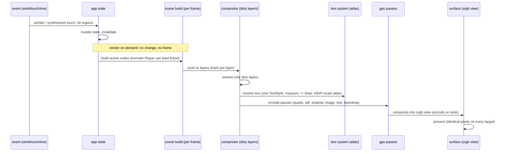

# plev

an experimental gpu-first compositing engine in rust. one codebase, one
pixel-identical frame on every target: macOS on Metal, the browser on
WebGPU, iOS on Metal, Android on Vulkan.

a scene is rebuilt every frame, the compositor resolves only the layers
that changed, and everything lands on an srgb surface. glass, backdrop
blur, analytic shadows, content-driven layout, real text shaping, HiDPI
rasterization at native scale. the apps consume the engine. nothing
bypasses it.

## why this exists

i started this about six years ago, long before LLMs, when i decided to
go deep into rust the honest way: build something real. the something
real was a children's education app for my daughter, one hundred percent
rust, and it needed an engine that didn't exist. so plev became the
engine underneath that dream.

let me be honest about what this is and what it is not. plev does not
compete with [flutter](https://flutter.dev), [egui](https://github.com/emilk/egui),
[dioxus](https://dioxuslabs.com) or [iced](https://iced.rs) — those are
serious projects built by serious teams, and i am one person learning in
public. some i studied more than i ever used: [makepad](https://makepad.dev)
and zed's [gpui](https://www.gpui.rs) are among the highest-level
engineering works i have seen in recent years, and [bevy](https://bevyengine.org)
taught me how a rust project can stay both ambitious and welcoming. plev
owes them most of what is good here. what is left, the mistakes, are
mine.

so this repo is exactly what it looks like: a personal experiment, done
humbly and in the open — what it takes for one person to build a small
indie engine with real memory control, performance first, everything on
the GPU, running on any device, ready for the LLM era. it already serves
beyond the original dream: [nest](https://github.com/hoffresearch/nest),
a sovereign embedded vector database, ships its explorer GUI
(`crates/nestui`) on plev. and the dream itself is still ahead: the
children's app that started all of this is the next thing to build.

if any of this resonates, come build with me.

## architecture

one render-on-demand loop. no change, no frame. unchanged layers cost
zero GPU work.



three tiers. the engine is its own crate at `crates/engine`; the repo
root is a virtual workspace. libraries and apps are sibling crates.
demos are the engine's examples.

| tier | where | what |
|---|---|---|
| engine | crate `engine` (crates/engine) | gpu, compositor, text, path, layout, input, animation, signal, theme, ui, charts, graph, builder, window, platform |
| crates | crates/ | git, ide, lot, macros, monster, svg, narrate, narrate-macro, nestui, parser, prime, rope, showcase |
| examples | crates/engine/examples/ | 16 windowed demos plus the lot2monsters and svg2monster clis |

machine map: [docs/arc/arc.yaml](docs/arc/arc.yaml). human reference:
[docs/arc/arc.md](docs/arc/arc.md). frame-flow diagram:
[docs/arc/arc.mmd](docs/arc/arc.mmd).

## binding contracts

violations are defects even when the pixels look right.

- one TextStyle per text run, shared by measurement and drawing. the
  only width source is the shaper, never an arithmetic estimate.
- srgb decode once entering gpu work, encode once at the surface write.
- container geometry derives from available space, never from constants.
- a visible state change implies invalidation. no silent redraws, no
  silent stale frames.

## install and run

requires rust edition 2024.

```
cargo build --release --workspace

cargo run -p showcase                  # the design-system gallery, 14 tabs
cargo run -p ide [path]                # plev-native git client
cargo run -p prime                     # prime-coherence particle swarm (codepen port)
cargo run -p engine --example charts   # any of the 16 windowed demos
cargo run -p engine --example snake
```

nestui, the .nest vector-db explorer, is its own workspace because its
native backend path-depends on a sibling checkout of
[nest](https://github.com/hoffresearch/nest) at `../nest`. with nest
cloned next to plev:

```
cargo run --manifest-path crates/nestui/Cargo.toml [file.nest]   # drop a file to open
```

web build (same pixels as desktop):

```
./script/web
```

the monster animation pipeline, a foreign format in and our format out:

```
cargo run -p engine --example lot2monsters in.json out.monster   # lottie -> monster
cargo run -p engine --example svg2monster  in.svg  out.monster   # svg (still) -> monster
cargo run -p engine --example monster_player out.monster         # play ours, no foreign code
```

## toolchain

use [rustup](https://rustup.rs): it reads `rust-toolchain.toml` (stable
+ rustfmt/clippy + the wasm32 target) and is required for the web/wasm
legs. a Homebrew rust ignores that file and ships no wasm32 std —
`script/gate` then skips the wasm check with a warning and CI
(.github/workflows/ci.yml) is the only full verification.

```
rustup target add wasm32-unknown-unknown   # the gate's wasm leg
cargo install trunk                        # script/web dev loop
```

## mobile

the showcase runs natively on Android and iOS from the same engine. it
is a library (`crate-type = ["lib", "cdylib", "staticlib"]`) whose app
shell exposes one entry point per platform; there is no kotlin or swift
ui, every pixel is drawn on the GPU by plev.

iOS (simulator) needs xcode, the `aarch64-apple-ios-sim` rust target and
`xcodegen`:

```
cd ios/showcase
./build_ios.sh      # cargo staticlib + xcodegen + xcodebuild
./run_ios.sh        # boot a simulator, install, launch, screenshot
```

Android needs the sdk/ndk, a jdk 17 and `cargo-ndk`:

```
cd android
./build_android.sh  # cargo-ndk -> jniLibs (arm64-v8a, x86_64) + gradle apk
                    # -> app/build/outputs/apk/debug/app-debug.apk
```

a GameActivity host (`MainActivity.kt`) loads `libshowcase.so` and hands
off to the rust `android_main`; on iOS a thin objc `main.m` calls
`showcase_ios_main`. the engine keeps its own `android_main` behind the
`android-entry` feature (off by default) so downstream apps ship their
own without a symbol clash.

## the monster format

a binary animation format, magic `MON0`, frozen at v1. keyframes are
full scene snapshots so seek is O(1); between them only discovered
deltas travel, and a node that does not change costs zero bytes.
quantized on the wire, checksummed per section, a description track per
keyframe for accessibility and search. it plays on the same engine that
draws the ui. `lot` reads a lottie json once, converts it to `.monster`,
and never embeds a foreign runtime. `svg` imports a still image through
the same door. discrete motion already beats the source json on size.
see [docs/adr/monster-format-v0.md](docs/adr/monster-format-v0.md).

## the parser

`crates/parser` turns ui source from another framework into plev builder
code. it maps colors to hoff theme tokens, obeys the engine contracts,
and reports every construct it cannot represent on a droplist with file
and line. it never drops a construct silently. run it live:

```
cargo run -p parser --example transpile  index.tsx module.sass vars.sass
cargo run -p parser --example preview    index.tsx module.sass vars.sass
```

## tests

```
cargo test --workspace
cargo clippy --workspace
cargo fmt --check
./script/gate     # the full four-part gate, stops on the first red
```

a guard test scans the repo and fails if any code draws text by
constructing a raw key instead of going through the one-TextStyle path.

criterion benches live on the hot path of each crate (`engine` scene
build, `rope` edits, `monster` codec, `lot` conversion, `parser`
transpile):

```
cargo bench                      # all benches
cargo bench -p rope              # one crate
```

## reference

- [docs/arc/arc.md](docs/arc/arc.md) for architecture, contracts, frame flow.
- [docs/arc/arc.yaml](docs/arc/arc.yaml) for the machine-readable map agents read.
- [docs/adr/](docs/adr/) for the architecture decision records.
- [docs/how-to/code-against-the-plev-engine.md](docs/how-to/code-against-the-plev-engine.md) for the operating manual.
- [.contracts/.agents/AGENTS.md](.contracts/.agents/AGENTS.md) for the single instruction source for ai agents and contributors. route every tool here, no per-tool files.

## license

made it simple, but significant.

Brenner Cruvinel.
(∂μfμν = jν)

MIT.
