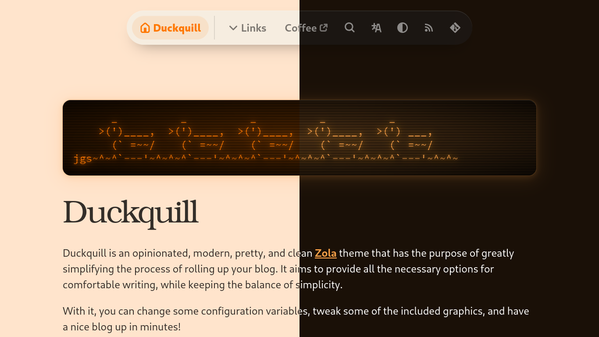

[](https://mit-license.org)

# [brenner](https://brennercruvinel.com)

the [Zola](https://www.getzola.org) theme i actually use to run brennercruvinel.com. opinionated, fast, and the part i care most about: a color system where a single variable drives the whole look, light and dark, with palettes you can switch from the nav.



## what it is

a Zola theme with light, dark, and system modes, plus a palette layer on top. pick a palette in the nav and the whole page re-themes: background, links, headings, the glow, the scrollbar, even the code blocks. six palettes ship by default, all contrast-checked.

## run it

```sh
zola serve   # dev server on http://127.0.0.1:1111, live reload
zola build   # static site into ./public
zola check   # validate internal and external links
```

## the color system

everything derives from one CSS variable, `--accent-color`. the background is a `color-mix` of the accent (6% over white in light, 15% over black in dark), the glow is the accent at low alpha, links and titles and active states are the accent, and the auto-contrast text on buttons is computed from it in OKLCH. so a palette only sets the accent, light and dark, and the rest follows. that is what keeps the themes consistent instead of drifting apart as a pile of hand-tuned variants.

two independent axes:

- `data-theme`: light, dark, system (the sun, moon, system icons at the top of the dropdown)
- `data-palette`: the color identity (the swatches below)

both live in one dropdown in the nav, persist in `localStorage`, and the default is rendered server-side so there is no flash on load.

### palettes

| id | name | character |
| --- | --- | --- |
| default | sunset orange | the original warm orange |
| orchid | electric orchid | violet |
| raindrops | purple raindrops | magenta into pink |
| emerald | emerald paradise | green |
| logseq | logseq | teal, logseq-flavored |
| candy | cotton candy | candy purple |

each palette ships a light accent (a deep rung that reads as link text on the near-white background) and a dark accent (a brighter rung that pops on the tinted dark background), both pulled from a curated ramp. the source hexes live in `palettes/`. every pair was contrast-checked: accent over its background, body text, secondary text, and each syntax token over the code panel all clear WCAG AA, at least 4.5:1. the how and why are in `kdb/adr/`.

### code blocks follow the palette

Zola bakes Solarized colors inline on every token, so by default code is green-on-navy in every theme. an author `!important` layer in `sass/_code-theme.scss` remaps each Solarized hex to a theme variable: keywords become the accent, the rest map to the theme's semantic colors. code joins the active palette instead of fighting it.

## configure

palettes live in three places, kept in sync:

- `config.toml`, `[extra].palettes`: the dropdown list (id, i18n name key, swatch dot)
- `sass/_palettes.scss`, the `$palettes` map: the light and dark accent per id
- `i18n/en.toml`: the display name, key `palette_<id>`

set the startup palette with `default_palette`. to drop a palette, remove it from those three. to add one, add it to all three.

```toml
default_palette = "logseq"
palettes = [
	{ id = "default", name = "palette_default", swatch = "#ff7800" },
	{ id = "logseq", name = "palette_logseq", swatch = "#1fbecf" },
	# ...
]
```

## dev tooling

the site builds with Zola alone, no Node needed. linters are optional and live as config only:

- `.editorconfig`, base formatting, stack agnostic
- `.stylelintrc.json` for SCSS, `eslint.config.mjs` for the static JS, `ruff.toml` for the Python helper, `taplo.toml` for TOML
- `npm install && npm run lint` to run the JS and SCSS linters

## license

MIT. use it, change it, ship it, no royalties, no usage restrictions. see [LICENSE](LICENSE).

*</> by [Brenner Cruvinel](https://github.com/brennercruvinel)*
